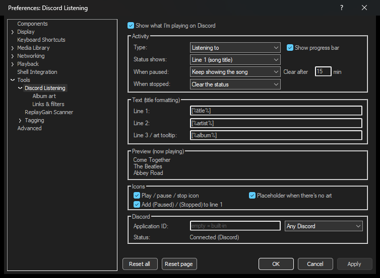
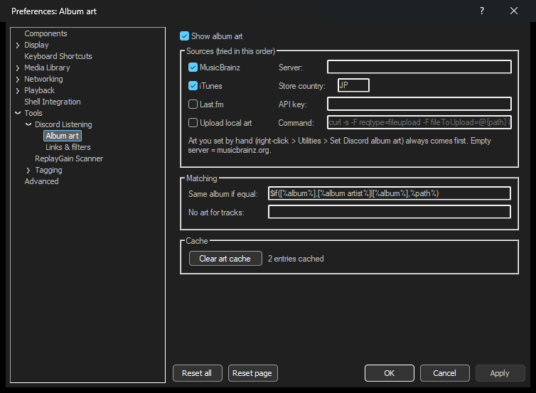
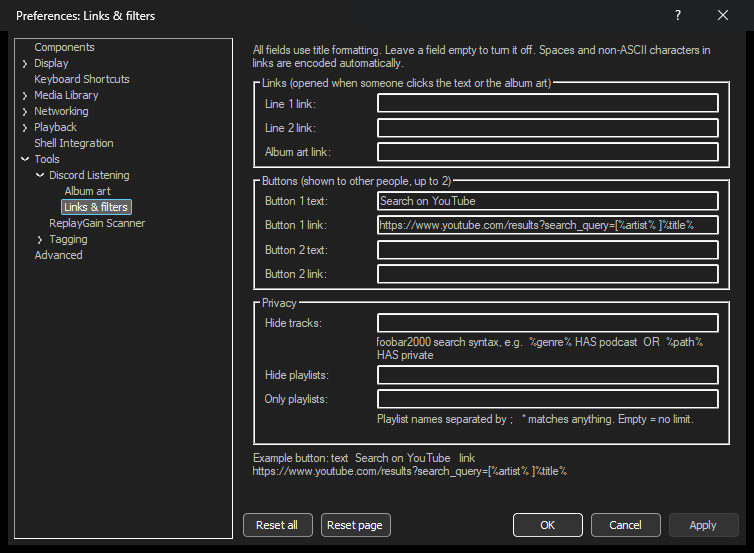

# foo_discord_listening

[繁體中文](README.md) · **English**

> Shows what you're playing in foobar2000 as a Discord "Listening to" activity, with a progress bar and album art.

[](https://github.com/Carinoasd/foo_discord_listening/actions/workflows/build.yml)
[](LICENSE)


A from-scratch foobar2000 component inspired by [foo_discord_rich](https://github.com/TheQwertiest/foo_discord_rich). The original has been unmaintained since 2024 and has many open issues, such as a stuck time display, missing album art, and settings that reset on restart. This rewrite was designed around those issue reports and uses no code from the original.

---

## Features

- **"Listening to" activity.** The member list shows the song title. You can show the artist or the application name instead, or switch the type to Playing or Watching.
- **Progress bar.** It resyncs on track change, seek, and resume. For internet radio, the elapsed time restarts whenever the station changes songs.
- **Album art**, tried in this order:
  1. **Set by hand.** Right-click a track to choose an image URL for its whole album.
  2. **MusicBrainz.** Uses the MBIDs in your tags first, otherwise searches by album and checks the title. If the album has no art, other releases of the same album are tried. A mirror server can be configured.
  3. **iTunes.** No key needed, with strong coverage of Japanese anime and game music.
  4. **Last.fm.** Needs your own API key.
  5. **Upload local art.** External or embedded art is downscaled to 512px and handed to an upload command of your choice.
- **Play / pause / stop icons** on the corner of the album art, and a placeholder image for tracks without art.
- **Links and buttons.** URLs opened when someone clicks the title, the artist, or the album art, and up to two buttons (for example, "Search on YouTube").
- **Privacy filters.** Hide the status, or skip album art, for tracks that match a foobar2000 search query.
- **Keep the status when stopped** (optional). The last song stays visible after you stop playback.
- **Clear when idle.** The status is cleared after you've been paused or stopped for a while (15 minutes by default), so it doesn't linger when you walk away.
- **Playlist filters.** Hide the status for some playlists, or show it only for some, with `*` wildcards.
- **Live preview** of the three text lines on the preferences page.
- **Choose a Discord client** when Discord, PTB, and Canary are running at the same time.
- **English, Traditional Chinese, Simplified Chinese, and Japanese UI**, picked from the Windows display language.
- **Moving from foo_discord_rich.** The settings you changed there are picked up on first start.
- **Never slows foobar2000 down.**
  - The Discord connection and all network requests run on background threads.
  - Every request has a timeout, and the component reconnects automatically when Discord starts.
  - Pending work is aborted immediately when foobar2000 exits, including a stuck upload command.
- Supports foobar2000 2.x x64 and x86. The preferences pages support dark mode.
- Checks for a new version once a day (can be turned off). On 32-bit foobar2000 you can also use [foo_acfu](https://acfu.3dyd.com/) (foo_acfu is 32-bit only).



## Installation

1. Download `foo_discord_listening-x.y.z.fb2k-component` from [Releases](https://github.com/Carinoasd/foo_discord_listening/releases).
2. In foobar2000, open **File > Preferences > Components**, drop the file in, click **Apply**, and restart.
3. Start playing music, and Discord shows "Listening to foobar2000".

Settings are in **File > Preferences > Tools > Discord Listening**, or open them with **Playback > Discord Listening settings**.

> If you have foo_discord_rich installed, remove it first. Both components update your Discord status and will overwrite each other. You don't need to copy your settings by hand: they are picked up on first start.

## Settings

### Main page

| Setting | Default | Notes |
| --- | --- | --- |
| Type | Listening to | Playing / Watching are also available |
| Status shows | Line 1 (song title) | What the member list and your status show |
| When paused | Keep showing the song | Or clear the status |
| Clear after N min | 15 | Clear after this long paused (or stopped, when keeping the last song); 0 = never |
| When stopped | Clear the status | Or keep showing the last song |
| Line 1 / 2 / 3 | `[%title%]` / `[%artist%]` / `[%album%]` | Title formatting; line 3 is also the album art tooltip |
| Icons | All on | Play / pause / stop icon, placeholder art, "(Paused)" on line 1 |
| Application ID | Empty | Empty uses the built-in one; see below to show a different name |
| Discord client | Any Discord | Pick Discord, PTB, or Canary when several are running |

The **Preview** box shows the current song with the three formats applied, updated as you type, before you click Apply.

### Album art



- **iTunes store country** defaults to `JP`, which has the best coverage of anime and game music. Use `US` if you mostly listen to Western music.
- Get a free **Last.fm API key** at [Last.fm API](https://www.last.fm/api/account/create).
- **Same album if equal** defines what counts as one album for hand-set art and uploads. The default is album artist plus album title.
- **No art for tracks** takes a query such as `%genre% HAS podcast`.
- **Set art by hand.** Right-click a track, choose **Utilities > Set Discord album art...**, and paste an https image URL. Leave it empty to go back to automatic art. Hand-set art survives "Clear art cache" and "Re-fetch".
- If the art is wrong, right-click and choose **Utilities > Re-fetch Discord album art**.

#### Uploading local art

For albums neither MusicBrainz nor iTunes knows:
- `{path}` in the command is replaced with the path of a downscaled JPEG.
- If the command has no `{path}`, the path is written to stdin, which is compatible with foo_discord_rich upload scripts.
- The first `https://` URL the command prints is used as the art.

Example using the curl that ships with Windows 10 and later, uploading to catbox.moe:

```
curl -s -F reqtype=fileupload -F fileToUpload=@{path} https://catbox.moe/user/api.php
```

> Uploading publishes your cover art on a third-party site. Pick a host that keeps files permanently: the URL is cached, and the art breaks if the file expires.

### Links & filters



All fields use title formatting. Leave a field empty to turn it off. Spaces and non-ASCII characters in links are encoded automatically.

Example button: text `Search on YouTube`, link:

```
https://www.youtube.com/results?search_query=[%artist% ]%title%
```

Only **other people** can click buttons and links. That's how Discord works.

**Hide playlists / Only playlists** take playlist names separated by `;`. `*` matches anything, and matching ignores case. For example, hide `Private;Podcast*`, or show only `Public*`. If both are set, hiding wins.

### Want a different name?

The "foobar2000" in "Listening to **foobar2000**" is the name of the built-in Discord application. To show something else, create your own:

1. Go to the [Discord Developer Portal](https://discord.com/developers/applications), click **New Application**, and name it what you want to show.
2. Copy the **Application ID** (a number) into the *Application ID* field and click **Apply**.

The application ID is not a secret.

## Troubleshooting

- **Nothing shows up.**
  - Enable *Share your detected activities with others* in Discord's **Activity Privacy** settings.
  - Run Discord and foobar2000 at the same privilege level. A Discord running as administrator can't be reached by a normal process.
  - Don't add foobar2000 as a "game" in Discord.
- **The art is a question mark or wrong.** Right-click and choose **Utilities > Re-fetch Discord album art**, or set it by hand. A `MUSICBRAINZ_ALBUMID` tag gives the most accurate results.
- **Logs.**
  - Messages in **View > Console** start with `[foo_discord_listening]`.
  - For more detail, enable *Write debug log* under **Preferences > Advanced > Tools > Discord Listening**. Everything sent to and received from Discord is then written to `foo_discord_listening\debug.log` in your profile folder. Please attach it when reporting issues.
- Discord doesn't show the progress bar on your own profile; others can see it. The Discord web app doesn't show this kind of status.

## Building

Requires Visual Studio 2022 (or the Build Tools), CMake 3.25+, and Ninja. The dependencies (foobar2000 SDK, WTL, nlohmann/json) are downloaded during configure and verified by SHA256.

```
cmake -S . -B build -G Ninja -DCMAKE_BUILD_TYPE=Release
cmake --build build
```

- When developing inside WSL, `scripts/build.sh [Release|Debug] [x64|x86]` drives the Windows MSVC toolchain.
- `tests/run.sh` runs the unit tests that don't need foobar2000 on Linux.
- `-DFDL_BUILD_TOOLS=ON` also builds `client_test.exe`, which tests connecting, reconnecting, rate limiting, and shutdown against a fake Discord server.

## License

MIT License, (C) 2026 Carinoasd. See [THIRD_PARTY_NOTICES.md](THIRD_PARTY_NOTICES.md) for third-party licenses. The icons are original to this project.
