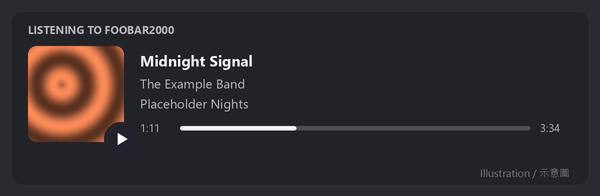
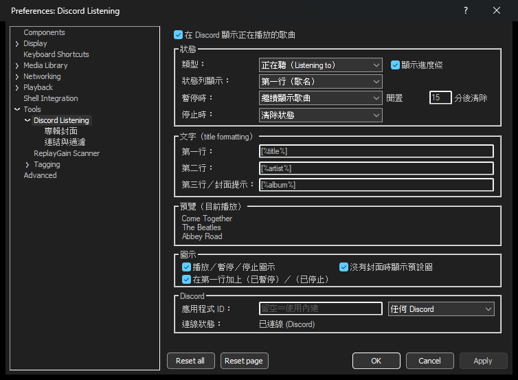
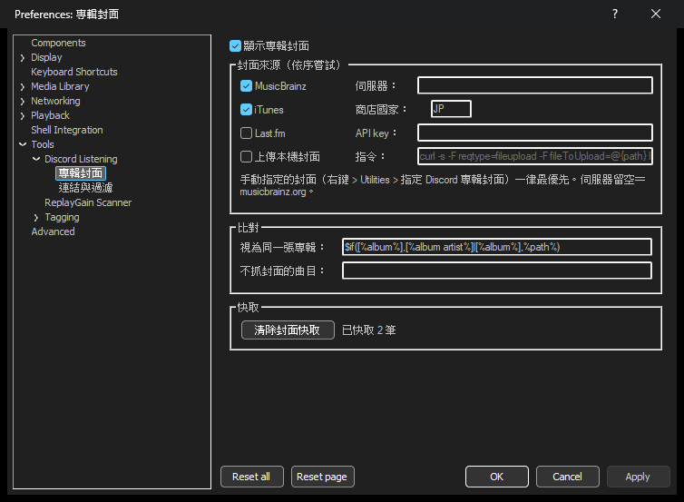
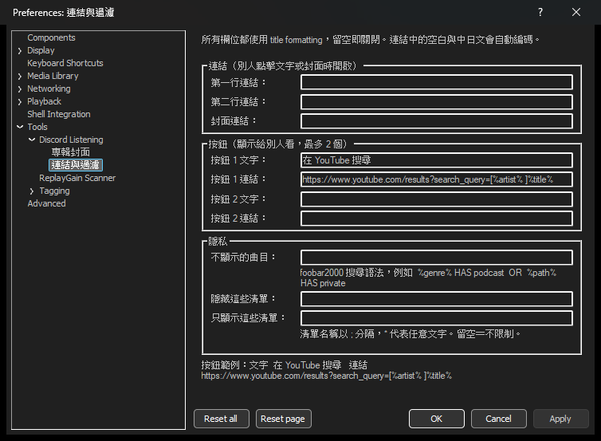

# foo_discord_listening

**繁體中文** · [English](README.en.md)

> 在 Discord 上顯示你正在用 foobar2000 聽什麼，狀態是「Listening to」，附進度條與專輯封面。
>
> Shows what you're playing in foobar2000 as a Discord "Listening to" activity, with a progress bar and album art.

[](https://github.com/Carinoasd/foo_discord_listening/actions/workflows/build.yml)
[](LICENSE)



這是一個從零重寫的 foobar2000 元件，靈感來自 [foo_discord_rich](https://github.com/TheQwertiest/foo_discord_rich)。原版自 2024 年起就沒有再維護，累積了不少問題，例如時間軸不動、封面不顯示、設定重開後被還原。這個版本參考了原版所有 issue 的討論重新設計，沒有沿用原版的程式碼。

---

## 功能

- **Listening to 狀態**：成員清單直接顯示歌名。也可以改成顯示歌手或應用程式名稱，類型也可改成 Playing 或 Watching。
- **進度條**：換曲、拖動、暫停後繼續都會重新對時。網路電台換歌時，經過時間會歸零。
- **專輯封面**，依序嘗試以下來源：
  1. **手動指定**：在曲目上按右鍵，為整張專輯指定圖片網址。
  2. **MusicBrainz**：優先用標籤裡的 MBID；沒有的話以專輯名稱搜尋並核對。專輯層級沒有封面時，會改找同專輯其他版本的封面。也可以指定鏡像站。
  3. **iTunes**：免申請 key，日本動畫、遊戲音樂收錄齊全。
  4. **Last.fm**：需要自己的 API key。
  5. **上傳本機封面**：把外部圖檔或內嵌封面縮成 512px 後，交給你指定的上傳指令。
- **播放／暫停／停止圖示**顯示在封面角落；曲目沒有封面時改顯示預設圖。
- **連結與按鈕**：點歌名、歌手或封面時開啟的網址，以及最多兩個按鈕（例如「在 YouTube 搜尋」）。
- **隱私過濾**：符合條件的曲目不顯示狀態，或不抓封面。條件使用 foobar2000 的搜尋語法。
- **停止時保留狀態**（可選）：停止播放後繼續顯示最後一首。
- **暫停太久自動清除**：暫停或停止超過指定分鐘數（預設 15 分鐘）就清除狀態，離開電腦後不會一直掛著。
- **依播放清單過濾**：從指定清單播放時不顯示，或只有指定清單才顯示，支援 `*` 萬用字元。
- **設定頁即時預覽**：修改三行文字時，直接看到目前這首歌套用後的樣子。
- **指定 Discord 版本**：同時開著正式版、PTB、Canary 時，可以選擇要顯示在哪一個。
- **多語系介面**：依 Windows 介面語言自動切換英文、繁體中文、簡體中文、日文。
- **從 foo_discord_rich 搬家**：第一次啟動時自動沿用你改過的設定。
- **不會拖慢 foobar2000**：
  - 與 Discord 的連線和所有網路請求都在背景執行。
  - 每個請求都有逾時；Discord 沒開時會自動重試。
  - 關閉 foobar2000 時會立即中斷進行中的工作，連卡住的上傳程式也會一起結束。
- 支援 foobar2000 2.x 的 x64 與 x86 版本，設定頁支援深色模式。
- 每天檢查一次有沒有新版本（可關閉）。32 位元的 foobar2000 也可以透過 [foo_acfu](https://acfu.3dyd.com/) 檢查更新（foo_acfu 只有 32 位元版）。



## 安裝

1. 到 [Releases](https://github.com/Carinoasd/foo_discord_listening/releases) 下載 `foo_discord_listening-x.y.z.fb2k-component`。
2. 在 foobar2000 開啟 **File > Preferences > Components**，把檔案拖進去，按 **Apply** 後重新啟動。
3. 開始播放音樂，Discord 就會顯示「Listening to foobar2000」。

設定在 **File > Preferences > Tools > Discord Listening**，或從 **Playback > Discord Listening 設定** 直接開啟。

> 如果你同時裝了 foo_discord_rich，請先移除。兩個元件會同時更新 Discord 狀態，互相覆蓋。移除前不必手動抄設定：本元件第一次啟動時會自動沿用。

## 設定

### 主頁

| 設定 | 預設 | 說明 |
| --- | --- | --- |
| 類型 | 正在聽（Listening to） | 也可改成 Playing / Watching |
| 狀態列顯示 | 第一行（歌名） | 成員清單與個人狀態列顯示的欄位 |
| 暫停時 | 繼續顯示歌曲 | 或清除狀態 |
| 閒置 N 分後清除 | 15 | 暫停或「停止時保留」超過這麼久就清除；0 為不清除 |
| 停止時 | 清除狀態 | 或保留最後一首歌 |
| 第一／二／三行 | `[%title%]` / `[%artist%]` / `[%album%]` | title formatting；第三行同時是封面的滑鼠提示 |
| 圖示 | 全部開啟 | 封面角落的播放／暫停／停止圖示、無封面預設圖、第一行加上「(已暫停)」 |
| 應用程式 ID | 空白 | 留空使用內建的；想顯示其他名稱見下方 |
| Discord 版本 | 任何 Discord | 同時開了多個版本時，指定正式版、PTB 或 Canary |

主頁的「預覽」區會即時顯示目前播放的歌套用三行格式後的樣子，修改格式時不用按 Apply 就能看到。

### 專輯封面



- **iTunes 商店國家**預設是 `JP`，日本商店對動畫和遊戲音樂的收錄最齊全。聽西洋音樂為主的話，可以改成 `US`。
- **Last.fm API key** 可以到 [Last.fm API](https://www.last.fm/api/account/create) 免費申請。
- **視為同一張專輯**決定了「手動指定」和「上傳」以什麼為單位，預設是「專輯歌手＋專輯名稱」。
- **不抓封面的曲目**例如 `%genre% HAS podcast`。
- **手動指定封面**：在曲目上按右鍵，選 **Utilities > 指定 Discord 專輯封面...**，貼上 https 圖片網址。留空則改回自動。手動指定的封面不會被「清除封面快取」或「重新抓取」移除。
- 封面抓錯時，按右鍵選 **Utilities > 重新抓取 Discord 專輯封面**。

#### 上傳本機封面

MusicBrainz 和 iTunes 都查不到的專輯，可以改用上傳：
- 指令中的 `{path}` 會替換成縮好的 JPEG 路徑。
- 沒寫 `{path}` 時，路徑從 stdin 傳入，這和 foo_discord_rich 的上傳腳本相容。
- 指令輸出的第一個 `https://` 網址會被當作封面。

範例（Windows 10 以上內建 curl，上傳到 catbox.moe）：

```
curl -s -F reqtype=fileupload -F fileToUpload=@{path} https://catbox.moe/user/api.php
```

> 上傳等於把封面公開到第三方網站。請選擇會長期保存檔案的服務：快取會記住網址，檔案過期後封面就會失效。

### 連結與過濾



所有欄位都使用 title formatting，留空即關閉，網址中的空白和中日文會自動編碼。

按鈕範例：文字填 `在 YouTube 搜尋`，連結填：

```
https://www.youtube.com/results?search_query=[%artist% ]%title%
```

按鈕和連結只有**別人**看得到，自己點不到，這是 Discord 的設計。

**隱藏這些清單／只顯示這些清單**：清單名稱以 `;` 分隔，`*` 代表任意文字，不分大小寫。例如隱藏 `私人;Podcast*`，或只顯示 `公開*`。兩者都設定時，隱藏優先。

### 想顯示其他名稱？

「Listening to **foobar2000**」裡的 foobar2000，是內建 Discord 應用程式的名稱。想換成別的字，可以自己建一個應用程式：

1. 到 [Discord Developer Portal](https://discord.com/developers/applications) 按 **New Application**，名稱填你想顯示的字。
2. 複製 **Application ID**（一串數字），貼到設定頁的 *應用程式 ID* 欄位，按 **Apply**。

Application ID 不是密碼，可以公開。

## 疑難排解

- **完全沒顯示**
  - 到 Discord 的 **使用者設定 > 活動隱私** 開啟「與其他人分享你的活動狀態」。
  - 確認 Discord 與 foobar2000 用相同權限執行：以系統管理員身分執行的 Discord，一般權限的程式連不到。
  - 不要在 Discord 裡把 foobar2000 手動加成「遊戲」。
- **封面是問號或錯的**：按右鍵 **Utilities > 重新抓取 Discord 專輯封面**，或用「指定 Discord 專輯封面」手動指定。替檔案加上 `MUSICBRAINZ_ALBUMID` 標籤最準確。
- **詳細紀錄**：
  - **View > Console** 裡的訊息都以 `[foo_discord_listening]` 開頭。
  - 需要更詳細的資料時，到 **Preferences > Advanced > Tools > Discord Listening** 開啟 *Write debug log*。送給 Discord 的內容和 Discord 的回應都會寫進 profile 資料夾裡的 `foo_discord_listening\debug.log`。回報問題時請附上這個檔案。
- 自己的個人檔案上看不到進度條，這是 Discord 的限制，別人看得到。網頁版 Discord 不會顯示這類狀態。

## 從原始碼建置

需要 Visual Studio 2022（或 Build Tools）、CMake 3.25 以上和 Ninja。依賴項目（foobar2000 SDK、WTL、nlohmann/json）會在設定時自動下載，並驗證 SHA256。

```
cmake -S . -B build -G Ninja -DCMAKE_BUILD_TYPE=Release
cmake --build build
```

- 在 WSL 裡開發的話，`scripts/build.sh [Release|Debug] [x64|x86]` 會呼叫 Windows 端的 MSVC 建置。
- `tests/run.sh` 在 Linux 上執行不依賴 foobar2000 的單元測試。
- 加上 `-DFDL_BUILD_TOOLS=ON` 會一併建置 `client_test.exe`，它用假的 Discord 伺服器測試連線、重連、限流與關閉流程。

## 授權

MIT License，(C) 2026 Carinoasd。第三方元件的授權見 [THIRD_PARTY_NOTICES.md](THIRD_PARTY_NOTICES.md)。圖示為本專案原創。
